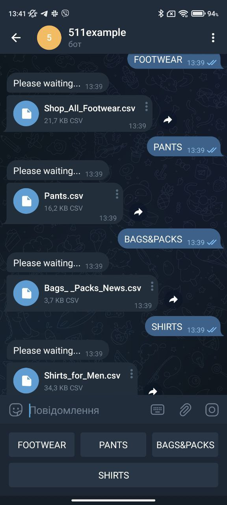

# Site parser - 511tactical (+telegram bot)
this parser is designed to collect information from the site 511tactical in 4 different categories and upload information to the chat in telegrams. the parser is executed in real time and leaves no data behind except the chat
___
### libraries that were used in writing the code
* requests
* BeautifulSoup
* aiogram
___
### data that was collected from the site and stored
* name
* price
* id
* image
* href
___
### file type in which the result is saved
 .csv
| name | price | id | image | href |
|------|-------|----|-------|------|
|text|text|text|text|text|
___
### telegram bot - @fivefiveonebot

